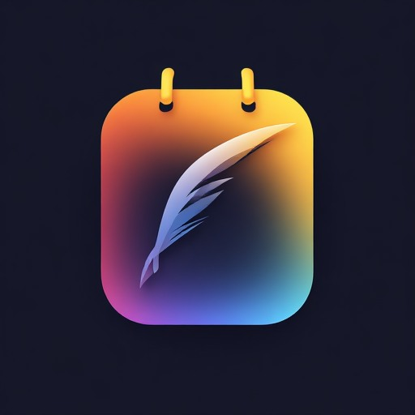

<h2 align="center">
    
    <br />
    <b>OmniTally | Minimalistic note taking app</b>
</h2>

<h3 align="center">A lightweight, privacy-focused note-taking app with powerful organization features.</h3>

---

## Features

- **Rich Text Editing** — Bold, italic, underline, strikethrough, monospace, bullet lists, links
- **Drawing Editor** — Create and annotate drawings with multiple tools (pen, eraser, colors, stroke width)
- **Image Support** — Add images to notes with multi-image viewing
- **Lists** — Checkable to-do lists with drag-and-drop reordering
- **Labels & Organization** — Organize notes with labels, folders (Notes, Archive, Trash), and a calendar view
- **Reminders** — Set date/time reminders with notifications
- **Backup & Restore** — Encrypted ZIP backups with internal AES encryption + standard export (Migrar)
- **Widget** — Home screen widget for quick note access
- **Multi-language** — 30+ languages supported

## Screenshots

<div style="display: flex; justify-content: space-between; width: 100%;">
  
  
  
</div>

## Download

Download the latest APK from [Releases](https://github.com/luxasfill/OmniTally/releases).

## Building from Source

1. Clone the repository:
   ```bash
   git clone https://github.com/luxasfill/OmniTally.git
   ```

2. Open in Android Studio or build from command line:
   ```bash
   ./gradlew assembleDebug
   ```

3. For release builds, add your signing configuration to `local.properties`:
   ```
   RELEASE_STORE_FILE=/path/to/your-keystore.jks
   RELEASE_STORE_PASSWORD=your-password
   RELEASE_KEY_ALIAS=your-alias
   RELEASE_KEY_PASSWORD=your-key-password
   ```
   Then run:
   ```bash
   ./gradlew assembleRelease
   ```

## Technical Details

- **Min SDK:** 21 (Android 5.0)
- **Target SDK:** 36
- **Language:** Kotlin
- **Architecture:** MVVM
- **Database:** Room
- **UI:** Material Design 3, Jetpack Navigation

## License

This project is licensed under the GPL-3.0 License - see the [LICENSE.md](LICENSE.md) file for details.

Based on [NotallyX](https://github.com/Crustack/NotallyX) by PhilKes.
